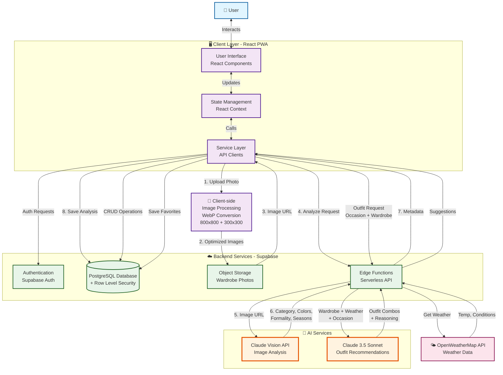

# Drobe System Architecture

## Overview

Drobe is an AI-powered wardrobe management Progressive Web App that helps users organize their clothing and receive intelligent outfit recommendations. The system integrates Claude Vision AI for automated clothing categorization and Claude's reasoning capabilities for personalized outfit suggestions based on user preferences, weather conditions, and occasion.

## Architecture Diagram

## Component Descriptions

### 1. Client Layer (React PWA)

**User Interface**
- **Tech Stack**: React 18, TypeScript, Tailwind CSS
- **Screens**:
  - Authentication (Sign In/Sign Up)
  - Preferences Onboarding
  - Wardrobe Management (Clothes & Outfits tabs)
  - AI Stylist (Outfit Suggestions)
  - Lookbook (Curated Inspiration)
  - Profile
- **Responsive Design**: Mobile-first with desktop preview mode
- **PWA Features**: Installable, works on iOS and Android

**State Management**
- **Technology**: React Context API
- **Contexts**:
  - `AuthContext`: User authentication and profile
  - `WardrobeContext`: Wardrobe items and CRUD operations
  - `OutfitContext`: Saved outfits and favorites
  - `WeatherContext`: Weather data with 30-minute cache

**Service Layer**
- **Image Service**: Client-side image processing (resize, compress, WebP conversion)
- **Auth Service**: Sign up, sign in, profile management
- **Wardrobe Service**: Item upload, AI analysis trigger, CRUD
- **Outfit Service**: Save combinations, toggle favorites
- **AI Service**: Wrapper for Edge Function calls
- **Weather Service**: Cached weather fetching

**Client-side Image Processing**
- Resizes uploaded photos to 800x800px (detail view)
- Generates 300x300px thumbnails (grid view)
- Converts to WebP format at 82% quality
- Target: <150KB per image
- **Why client-side?**: Reduces bandwidth, storage costs, and server load

### 2. Backend Services (Supabase)

**Authentication**
- Email/password authentication
- Session management with JWT tokens
- Auto-refresh tokens stored in localStorage

**PostgreSQL Database**
- **Tables**:
  - `profiles`: User information and preferences (gender, age, style, colors)
  - `wardrobe_items`: Clothing with AI metadata
  - `outfits`: Saved outfit combinations
  - `planned_outfits`: Calendar events (future feature)
- **Security**: Row Level Security (RLS) policies ensure users only access their own data

**Object Storage**
- **Bucket**: `wardrobe-photos`
- Stores optimized images and thumbnails
- Public read access, authenticated write
- File structure: `{user_id}/{timestamp}-{filename}.webp`

**Edge Functions (Serverless)**
- **Runtime**: Deno (TypeScript)
- **Purpose**: Hide API keys from client, server-side AI calls
- **Functions**:
  1. `analyze-clothing`: Clothing categorization
  2. `suggest-outfits`: Outfit recommendations
  3. `get-weather`: Weather proxy

### 3. AI Services

**Claude Vision API (Clothing Analysis)**
- **Model**: Claude 3.5 Sonnet (Vision)
- **Input**: Image URL from Supabase Storage
- **Output**: Structured JSON with:
  - Category (tops, bottoms, outerwear, shoes, accessories)
  - Subcategory (t-shirt, jeans, blazer, etc.)
  - Colors array
  - Seasons (spring, summer, fall, winter, all-season)
  - Formality (casual, smart_casual, formal)
  - Patterns (solid, striped, floral, etc.)
  - Style notes
- **Cost**: One-time call per uploaded item
- **Latency**: ~2-4 seconds per image

**Claude 3.5 Sonnet (Outfit Recommendations)**
- **Model**: Claude 3.5 Sonnet (Text)
- **Input**:
  - User's occasion (e.g., "job interview", "date night")
  - User preferences (gender, age, style, color palettes)
  - Weather conditions (temp, conditions, wind)
  - Wardrobe items (category, colors, formality)
- **Output**: 2-3 outfit suggestions with:
  - Creative outfit name
  - Item combinations (array of wardrobe item IDs)
  - AI reasoning (why this combination works)
- **Personalization**: Uses user demographics and style preferences
- **Cost**: ~$0.01 per suggestion request

### 4. External Services

**OpenWeatherMap API**
- **Tier**: Free (1000 calls/day)
- **Data**: Current weather (temp, feels-like, conditions, wind, precipitation)
- **Default Location**: Evanston, IL 60201 (configurable in profile)
- **Cache**: 30 minutes client-side
- **Integration**: Called via Edge Function to hide API key

## Data Flow Examples

### Example 1: Upload & Analyze Clothing Item

1. **User** uploads photo via Wardrobe screen
2. **Image Service** (client) resizes to 800x800 and creates 300x300 thumbnail, converts to WebP
3. **Wardrobe Service** uploads both images to Supabase Storage
4. Storage returns public URLs
5. **Wardrobe Service** creates database record with URLs and temporary metadata
6. **Wardrobe Service** calls `analyze-clothing` Edge Function with image URL
7. **Edge Function** sends image URL to Claude Vision API
8. **Claude Vision** analyzes image, returns structured JSON
9. **Edge Function** strips markdown from response, parses JSON
10. **Wardrobe Service** updates database record with AI metadata
11. **UI** displays analyzed item with correct category, colors, tags

**Timeline**: ~3-5 seconds total

### Example 2: Generate Outfit Suggestions

1. **User** enters occasion on AI Stylist screen (e.g., "job interview")
2. **AI Service** fetches user's wardrobe from context
3. **Weather Service** fetches current weather (from cache if recent)
4. **AI Service** calls `suggest-outfits` Edge Function with:
   - Occasion text
   - User preferences (gender, age, style, colors)
   - Weather data
   - Wardrobe items (simplified: ID, category, subcategory, colors, formality)
5. **Edge Function** builds prompt incorporating user preferences and weather
6. **Claude 3.5 Sonnet** generates 2-3 outfit combinations with reasoning
7. **Edge Function** maps item indices back to full wardrobe items
8. **AI Service** receives suggestions, displays in UI
9. **User** can save favorites to database
10. **Outfit Service** saves to `outfits` table with AI reasoning and weather snapshot

**Timeline**: ~4-8 seconds total

### Example 3: View Saved Outfit

1. **User** navigates to Wardrobe > Outfits tab
2. **Outfit Context** fetches all outfits with `is_favorite = true`
3. For each outfit, fetch full wardrobe items by ID
4. **UI** displays 2x2 grid of first 4 items from each outfit
5. **User** taps outfit to see detail modal
6. Modal shows:
   - Outfit name (e.g., "Garden Ceremony")
   - Occasion (e.g., "wedding")
   - All items with photos
   - Option to unfavorite

## Production Deployment Architecture

**Current MVP Deployment**:
- **Frontend**: Vercel (drobe-eight.vercel.app)
- **Backend**: Supabase Cloud (effebwcunhixinehmozb.supabase.co)
- **Edge Functions**: Supabase Edge Functions
- **CDN**: Automatic via Vercel and Supabase

**Future Production Considerations**:
- **Scaling**: Supabase scales automatically, Vercel handles frontend CDN
- **Cost Optimization**:
  - Monitor Claude API usage (current: ~$5-10/month for beta users)
  - Consider caching common outfit suggestions
  - Implement rate limiting (20 outfit requests/user/day)
- **Performance**:
  - Image CDN already optimized via Supabase Storage
  - Consider lazy loading for large wardrobes
  - Outfit suggestion caching by occasion type
- **Monitoring**:
  - Supabase logs for Edge Function errors
  - Vercel analytics for frontend performance
  - Claude API usage tracking via Anthropic dashboard

## Security & Privacy

**Authentication**:
- Secure JWT tokens with auto-refresh
- Passwords hashed via Supabase Auth (bcrypt)
- HTTPS enforced on all endpoints

**Data Access**:
- Row Level Security (RLS) policies on all tables
- Users can only access their own wardrobe, outfits, profile
- Storage bucket has RLS for uploads

**API Keys**:
- Never exposed to client
- Stored as environment variables in Supabase Edge Functions
- Anthropic API key, OpenWeather API key secured server-side

**Image Privacy**:
- Photos stored in public bucket but with unguessable URLs
- Only user knows their own photo URLs
- Future: Consider private bucket with signed URLs

## Technology Decisions & Rationale

| Decision | Rationale |
|----------|-----------|
| **React + TypeScript** | Type safety, large ecosystem, PWA support |
| **Supabase over Firebase** | PostgreSQL is more flexible, better RLS, no vendor lock-in |
| **Claude Vision** | Best-in-class multimodal model, better than GPT-4V for clothing |
| **Edge Functions** | Hide API keys, server-side AI calls, zero cold start |
| **Client-side Image Processing** | Reduce bandwidth and storage costs by 90% |
| **Context API vs Redux** | Simpler for MVP scope, less boilerplate |
| **Tailwind CSS** | Rapid UI development, design system consistency |
| **No Background Removal** | Deferred to v2 to reduce complexity and cost |

## Future Architecture Enhancements

**Short-term** (v1.1):
- Calendar integration for outfit planning
- Social features (share outfits with friends)
- Advanced filtering and search
- Background removal for clothing photos

**Long-term** (v2.0):
- Recommendation engine using embeddings for style similarity
- Shopping recommendations based on wardrobe gaps
- Wear tracking analytics and insights
- Multi-user (families, stylists, clients)
- Mobile native apps (React Native)
- Offline-first architecture with local-first sync

---

**Last Updated**: March 11, 2026
